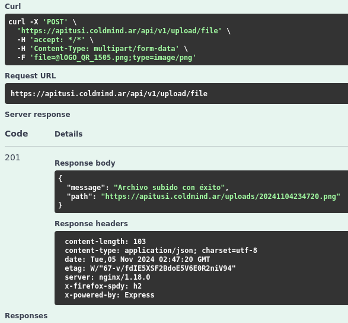

# TPI_TUSI


```
cd existing_repo
git clone https://gitlab.com/coldmindsoluciones/tpi_tusi.git
```

# PHPMyAdmin

- `http://localhost:8090/`
- user: tusi
- pass: tusi
- db: tusi
- port: 3306
- phpmyadmin_user: tusi
- phpmyadmin_pass: tusi

## SQL
Dentro de la base de datos tusi ejecutar los script en este orden:
- tablas.sql
- insertarPaisPciaCiudad.sql
- insertarRoles.sql

## Manejo de imagenes

- endpoint para subida: `https://apitusi.coldmind.ar/api/v1/upload/file`
- el mismo debe ser de tipo post y llevar 'file' de nombre para que el endpoint lo capture.
- en swagger se puede ver la documentacion en `https://apitusi.coldmind.ar/api`
- desde esa direccion se puede probar sin problemas de manera visual.
- para ver la imagen subida se debe copiar el 'path' devuelto, por ej: `https://apitusi.coldmind.ar/uploads/fechaHora.png`

